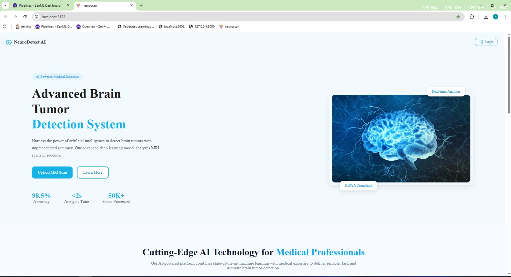
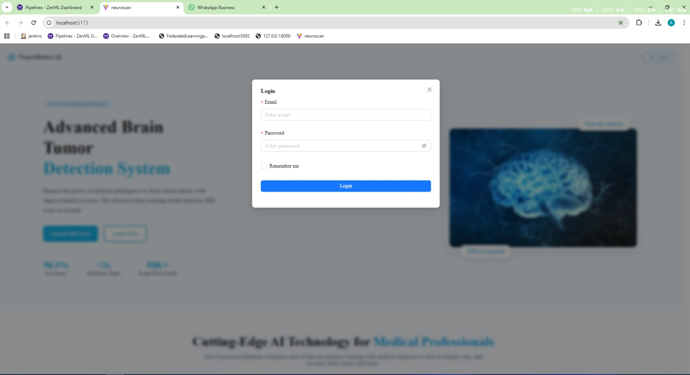
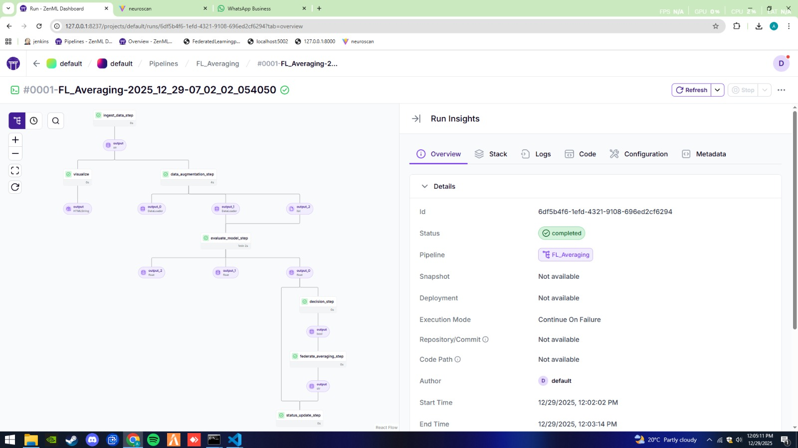
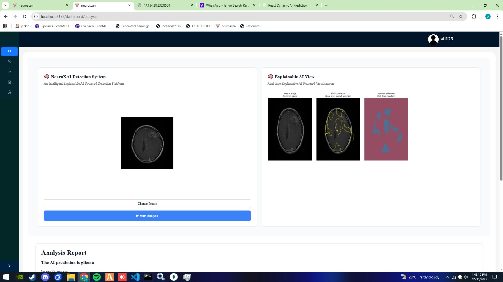

# Brain Tumor Frontend


This repository presents a brain tumor detection system built using Convolutional Neural Networks (CNNs) and ZenML, designed to provide an end-to-end, well-structured machine learning workflow. The project focuses on classifying MRI brain images to identify the presence and type of tumors, combining deep learning techniques with ZenML’s pipeline-based MLOps framework to ensure reproducibility, scalability, and clear experiment tracking. By organizing data preprocessing, model training, evaluation, and deployment into modular steps, the repository makes it easier to develop, validate, and maintain an accurate brain tumor detection solution suitable for research and real-world applications.


##  Getting Started

Follow these steps to set up the project locally.

### Prerequisites
- Node.js (>= 18)
- npm or yarn

## First setup backend to setup follow these process 

### Backend FASTAPI

[](https://github.com/Amin-0513/brain-tumor-backend.git)

### ZENML Deep Learning Pipeline
[](https://github.com/Amin-0513/zenml-deep-learning-pipeline.git)

### ZenML Federated Learning Pipeline
[](https://github.com/Amin-0513/federated-mlflow-pipeline.git)

```bash
# Clone the repository
git clone https://github.com/Amin-0513/brain-tumor-frontend.git

# Navigate to project directory
cd brain-tumor-frontend

# Install dependencies
npm install
# or
yarn install
## Start project
npm run dev
```


### User Interface
<table>
  <tr>
    <td></td>
    <td></td>
  </tr>
  <tr>
    <td></td>
    <td></td>
  </tr>
</table>





